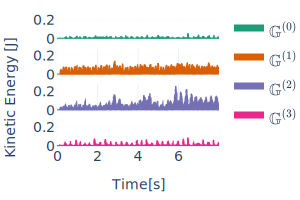
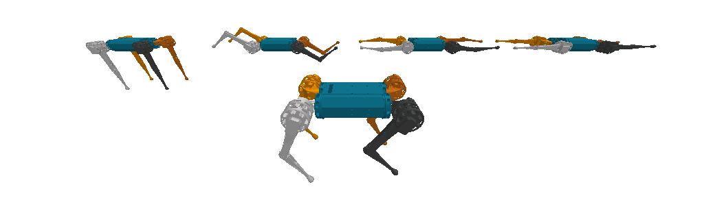
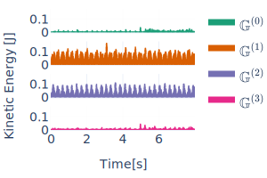
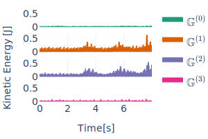

# Dynamics Harmonics Analysis of robotic systems: Application in Data-Driven Koopman Modelling

## Harmonics Analysis on library of robotics systems. 

This work relies in [MorphoSymm](https://github.com/Danfoa/MorphoSymm) to enable the use of harmonic analysis on the state/phase space of [a library of robotic systems](https://github.com/Danfoa/MorphoSymm?tab=readme-ov-file#library-of-symmetric-dynamical-systems) with [Morphological Symmetries](https://arxiv.org/abs/2402.15552).   

In this work we focus on the Mini-Cheetah quadruped robot, for which we apply harmonics analysis in order to decompose the dynamics of locomotion of the system 

### Harmonics Analysis of the joint-space dynamics of the Mini Cheetah robot

Here we show the application of the isotypic decomposition to the robot's joint-space generalized position
coordinates $\mathcal{Q}_{js} \subseteq \mathbb{R}^{12}$.

When we consider the symmetry group of the robot as the Klein-4 group $\mathbb{G} = \mathbb{K}_4 = \\{e, g_s, g_t, g_r\\}$, the joint-space decomposes into four isotypic subspaces of the same dimension:
```math
\mathcal{Q}_{js} = \mathcal{Q}_{js,1} \oplus \mathcal{Q}_{js,2} \oplus  \mathcal{Q}_{js,3} \oplus  \mathcal{Q}_{js,4} \quad | \;  \mathcal{Q}_{js,4} \subseteq \mathbb{R}^3
```
Each isotypic subspace $\mathcal{Q}_{js, i}$ represents a space of synergistic motions that are restricted to feature only a subset of the symmetries of the system. Following our paper's notation, the symmetry transformations for each isotypic component are the following:

```math
\begin{align*}
g \diamond \symbf{q}(\symbf{\omega})^{(1)} \quad &| \quad \symbf{q}(\symbf{\omega})^{(1)} \in \mathcal{Q}_{js,1},\;\; g \in \mathbb{G}^{(1)} = \{e\}      \\
g \diamond \symbf{q}(\symbf{\omega})^{(2)} \quad &| \quad \symbf{q}(\symbf{\omega})^{(2)} \in \mathcal{Q}_{js,2},\;\; g \in \mathbb{G}^{(2)} = \{e, g_t\} \\
g \diamond \symbf{q}(\symbf{\omega})^{(3)} \quad &| \quad \symbf{q}(\symbf{\omega})^{(3)} \in \mathcal{Q}_{js,3},\;\; g \in \mathbb{G}^{(3)} = \{e, g_r\} \\
g \diamond \symbf{q}(\symbf{\omega})^{(4)} \quad &| \quad \symbf{q}(\symbf{\omega})^{(4)} \in \mathcal{Q}_{js,4},\;\; g \in \mathbb{G}^{(4)} = \{e, g_s\} 
\end{align*}
```
We can interprete the dimensions of each subspace, as being determined by the symmetry constraints imposed on each subspace.

By projecting an entire trajectory of motion to these spaces, we are able to characterize the motion as the superposition of lower-dimensional and synergistic motions, as presented in the following animations of different gait types and terrains.
The robots in the background are representing the configurations of each isotypic subspace (left-most is the first subspace). While the robot in the front shows the recorded motion.

Next to each animation we plot the kinetic energy of each of the configurations on an isotypic subspace (the background robots). This allows us to quantify how relevant is each isotypic subspace for the generation of the motion of interest. For further details, please refer to the papaer, or create a question in the discussions section of this repository.

## Trotting gait
### In forest
[//]: # (recording_name=forest)
<p float="left">
  
   
</p>

### In grass
[//]: # (recording_name=grass)
<p float="left">
  
  
</p>

### In concrete
[//]: # (recording_name=concrete_difficult_slippery)
<p float="left">
  
  
</p>

### In concrete while walking in circles
[//]: # (recording_name=concrete_right_circle)
<p float="left">
  
  
</p>

### In terrain of middle sized pebbles
[//]: # (recording_name=middle_pebble)
<p float="left">
  
  
</p>

For other gait types and terrains, refer to the project [website](https://danfoa.github.io/DynamicsHarmonicsAnalysis/)

## Dynamics Harmonics Analysis and Koopman Operator Modeling 

Our work extends and adapts this decomposition of the robot's configuration space to the space of all observable functions of the system's state. This function space is used to model the system's dynamics in an infinite dimensional space, in which the dynamics are governed by linear integral operators, commonly denoted as Koopman operators. As dynamics in this function space are linear, the use of harmonics analysis leads to a decomposition of the system's dynamics into independent linear subsystems on each of the isotypic subspaces of the function space. Our work exploits this decomposition to improve data-driven approximations of the system's Koopman operator. 

### Experiments Reproduction 

We present two experiments comparing the performance between equivariant and non-equivariant Koopman models approximated using the [DAE](nn/DynamicsAutoEncoder.py) and [eDAE](nn/EquivDynamicsAutoencoder.py) architectures:

1. Synthetic symmetric dynamical systems with finite state symmetry groups

This experiment takes symmetry-constrained synthetic linear systems and tries to approximate the Koopman operator that linearly models the dynamics of these systems. A 3D dimensional example of such systems can be interactively visualized 
[here](data/linear_system/group=C3-dim=3/n_constraints=1/f_time_constant=2.9[s]-frames=200-horizon=17.7[s]/noise_level=1/test_trajectories.html). Specifically, these are stable linear systems with hyperplane constraints that enforce a particular symmetry group, in the case of the example the rotation group of order 3.

To train the DAE and eDAE architectures on a C3-equivariant linear system in `30` dimensions with a latent modeling space of dimension `90` you can use the following command:   
```shell
python train_observables.py --multirun model=edae,dae system=linear_system system.group=C3 system.n_constraints=1 system.obs_state_ratio=3 system.state_dim=30
```
Note that, to generate the dataset for any specific symmetry group and state dimensionality, you can use the script [stable_linear_system.py](data/linear_system/stable_linear_system.py)

2. Modeling quadruped closed-loop dynamics

To train the DAE, DAEaug, and eDAE architectures to model the closed-loop dynamics of the Mini-cheetah quadruped robot, exploiting its K4xC2 symmetry group or its K4 and C2 subsgroups, you can use the following command: 
```shell
python train_observables.py --multirun model=dae,dae-aug,edae system=mini_cheetah,mini_cheetah-k4,mini_cheetah-c2 system.terrain=uneven_easy
```

_The [train_observables.py](./train_observables.py) script will run the entire training pipeline and generate a weights & biases summary report online. Note that, in the [launch](launch/) folder, you can find the shell files used to reproduce each of the experiments of the paper_

### Paper
This repository holds the code for the paper [Dynamics Harmonic Analysis of Robotic Systems: Application in Data-Driven Koopman Modelling](https://arxiv.org/abs/2312.07457). If you find the paper or the repository useful, please cite us as:
```
@article{ordonez2023dynamics,
  title={Dynamics Harmonic Analysis of Robotic Systems: Application in Data-Driven Koopman Modelling},
  author={Ordo{\~n}ez-Apraez, Daniel and Kostic, Vladimir and Turrisi, Giulio and Novelli, Pietro and Mastalli, Carlos and Semini, Claudio and Pontil, Massimiliano},
  journal={arXiv preprint arXiv:2312.07457},
  year={2023}
}
```