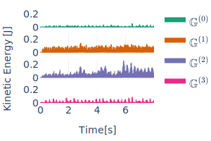
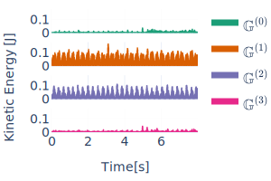
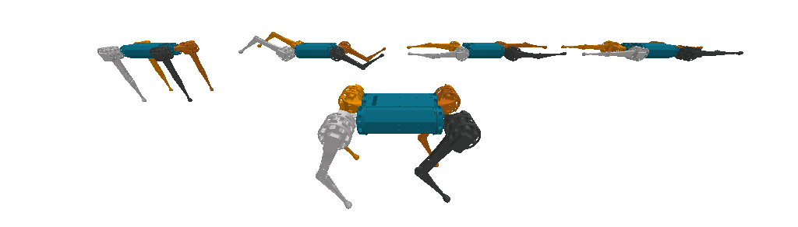
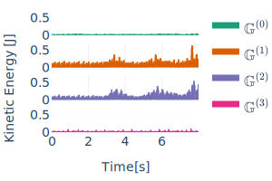
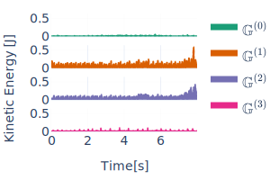
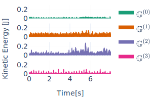
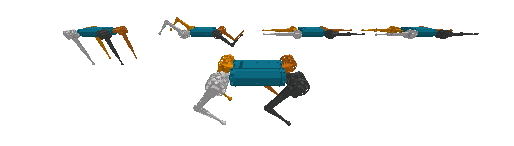
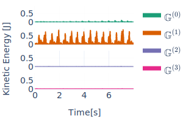
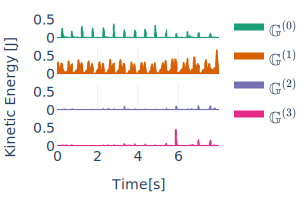
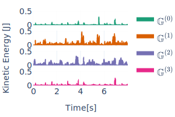

# Harmonics Analysis of the joint-space dynamics of the Mini Cheetah robot

Here we show the application of the isotypic decomposition to the robot's joint-space generalized position
coordinates $\mathcal{Q}_{js} \subseteq \mathbb{R}^{12}$.

When we consider the symmetry group of the robot as the Klein-4 group $\mathbb{G} = \mathbb{K}_4 = \\{e, g_s, g_t, g_r\\}$, the joint-space decomposes into 4 isotypic subspaces of the same dimension:
```math
\mathcal{Q}_{js} = \mathcal{Q}_{js,1} \oplus \mathcal{Q}_{js,2} \oplus  \mathcal{Q}_{js,3} \oplus  \mathcal{Q}_{js,4} \quad | \;  \mathcal{Q}_{js,4} \subseteq \mathbb{R}^3
```
Each isotypic subspace $\mathcal{Q}_{js, i}$ represents a space of synergistic motions that are restricted to feature only a subset of the symmetries of the system. Following our paper's notation the symmetry transformations for each isotypic components are the following:

```math
\begin{align*}
g \diamond \symbf{q}(\symbf{\omega})^{(1)} \quad &| \quad \symbf{q}(\symbf{\omega})^{(1)} \in \mathcal{Q}_{js,1},\;\; g \in \mathbb{G}^{(1)} = \{e\}      \\
g \diamond \symbf{q}(\symbf{\omega})^{(2)} \quad &| \quad \symbf{q}(\symbf{\omega})^{(2)} \in \mathcal{Q}_{js,2},\;\; g \in \mathbb{G}^{(2)} = \{e, g_t\} \\
g \diamond \symbf{q}(\symbf{\omega})^{(3)} \quad &| \quad \symbf{q}(\symbf{\omega})^{(3)} \in \mathcal{Q}_{js,3},\;\; g \in \mathbb{G}^{(3)} = \{e, g_r\} \\
g \diamond \symbf{q}(\symbf{\omega})^{(4)} \quad &| \quad \symbf{q}(\symbf{\omega})^{(4)} \in \mathcal{Q}_{js,4},\;\; g \in \mathbb{G}^{(4)} = \{e, g_s\} 
\end{align*}
```
We can interprete the dimensions of each subspace, as being determined by the symmetry constraints imposed on each subspace.

By projecting an entire trajectory of motion to these spaces, we are able to characterize the motion as the superposition of lower-dimensional and synergistic motions, as presented in the following animations of different gait types and terrains.
The robots in the background are representing the configurations of each isotypic subspace (left-most is the first subspace). While the robot in the front shows the recorded motion.

Next to each animation we plot the kinetic energy of each of the configurations on an isotypic subspace (the background robots). This allows us to quantify how relevant is each isotypic subspace for the generation of the motion of interest. For further details, please refer to the papaer, or create a question in the discussions section of this repository.

## Trotting gait 
### In forest
[//]: # (recording_name=forest)
<p float="left">
  
   
</p>

### In grass 
[//]: # (recording_name=grass)
<p float="left">
  
  
</p>

### In concrete
[//]: # (recording_name=concrete_difficult_slippery)
<p float="left">
  
  
</p>

### In concrete while walking in circles
[//]: # (recording_name=concrete_right_circle)
<p float="left">
  
  
</p>

### In terrain of middle sized pebbles
[//]: # (recording_name=middle_pebble)
<p float="left">
  
  
</p>


## Jumping gait
### In concrete 
[//]: # (recording_name=air_jumping_gait)
<p float="left">
  
  
</p>

## Pronking gait
### In concrete
[//]: # (recording_name=concrete_pronking)
<p float="left">
  
  
</p>

## Galloping gait 
### In concrete
[//]: # (recording_name=concrete_galloping)
<p float="left">
  
  
</p>

[](data/mini_cheetah/recordings/concrete_galloping/work_concrete_galloping_decomp.html)
